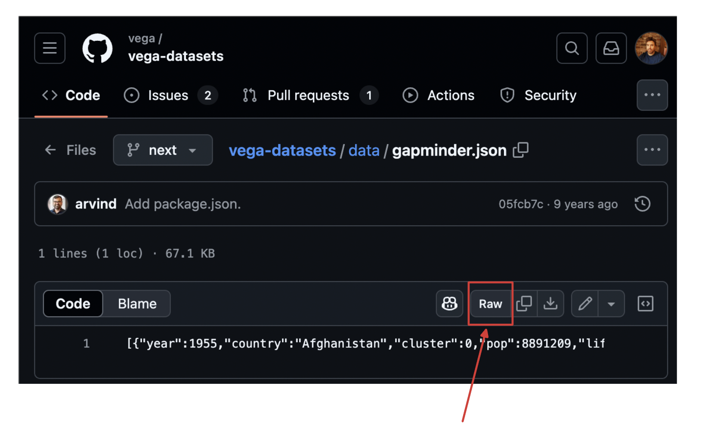

# WID 9 - HA-Lösung

## Vega-Lite Beispiel

https://vega.github.io/vega-lite/examples/interactive_global_development.html

## Einbinden von Daten

### 1. Option

- Mit `altair` (Jupyter) Spec+Daten als eine Spec-JSON exportieren

### 2. Option

- Datensatz finden und in der Spec verlinken

**Vega-Lite Spec**:

- Dieses Beispiel nutzt die `gapminder.json` Daten

```json
{
  "$schema": "https://vega.github.io/schema/vega-lite/v5.json",
  "description": "An interactive scatter plot of global health statistics by country and year.",
  "data": { "url": "data/gapminder.json" },
  "width": 800,
  "height": 500
  // ...
}
```

**Datensatz finden**:

- https://github.com/vega/vega-datasets/tree/next
- "raw" Ansicht wählen



**Spec anpassen**

```json
{
  "$schema": "https://vega.github.io/schema/vega-lite/v5.json",
  "description": "An interactive scatter plot of global health statistics by country and year.",
  "data": {
    "url": "https://raw.githubusercontent.com/vega/vega-datasets/refs/heads/next/data/gapminder.json"
  },
  "width": 800,
  "height": 500
  // ...
}
```
