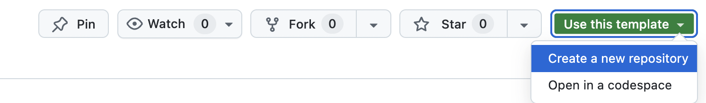

# React + MUI Vorlage

## Installation

### 1. Neues Repository erstellen

- für neuen Projekte einfach die "Use this template" Funktion von GitHub verwenden:
  

### 2. Installieren

1. Neues Projekt Repository in ein gewünschtes lokate Verzeichnis klonen:

```sh
git clone <repo-url>
```

2. In der Projektordner wechseln:

```sh
cd <repo-name>
```

3. `npm` Abhängigkeiten installieren:

```sh
npm install
```

4. dev-Server starten:

```sh
npm run dev
```
